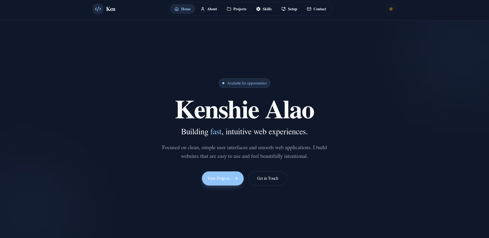

  

   
   

  <h1>Personal Portfolio</h1>

  

    
    
    
    
  

---

## About

This is my personal portfolio website where I share my projects, skills, and experience as a developer. It serves as a place to showcase what I have learned and the work I have built.

---

## Features

- View my projects and side projects
- Learn about the technologies I use
- Explore my skills and development tools
- Contact me through my social links

---

## Tech Stack

### Core

- Next.js
- React
- TypeScript

### Styling & UI

- Tailwind CSS 4
- Framer Motion
- Radix UI
- Lucide React
- React Icons
- Class Variance Authority (CVA)
- clsx
- tailwind-merge

---

## Contact

Feel free to connect with me through the links on the website. I'm always interested in learning, building projects, and improving my skills as a developer.

 

  Built by Kenshien Alao

